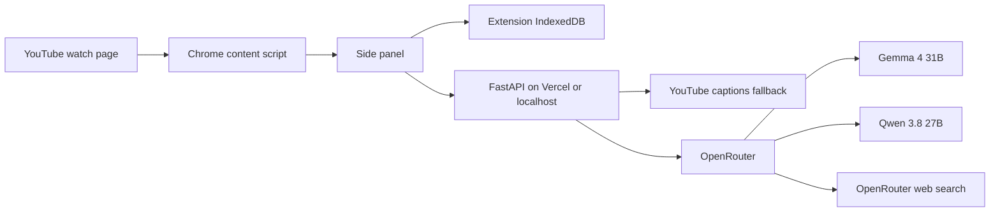

# Architecture

The content script reads the current URL, player time, duration, and captions without injecting inline page scripts. The side panel polls player state for the live companion and sends seek/play/pause commands back to the content script. Captions discovered by the page are included in requests; when absent, the API tries `youtube-transcript-api` and `yt-dlp`.

Gemma produces the structured transcript analysis, watch plans, moment-aware answers, quizzes, flashcards, factual claim candidates, and multi-video comparisons. Qwen receives a direct low-resolution video stream plus sampled transcript context and identifies visual events and information shown but barely spoken. Gemma retries the visual request only when Qwen is unavailable, rate-limited, or produces invalid structured output.

Generated transcript timestamps and excerpts pass through deterministic evidence checks before reaching the UI. Claim Check is a separate Gemma request with the OpenRouter web-search tool; a claim is labelled checked only when the provider returns URL citations. The extension renders those source links beside the claim.

The backend stores no database or vector index, which keeps Vercel Functions stateless. The personal knowledge library uses IndexedDB in the Chrome extension. Cross-device synchronization would require a separate authenticated backend store.
