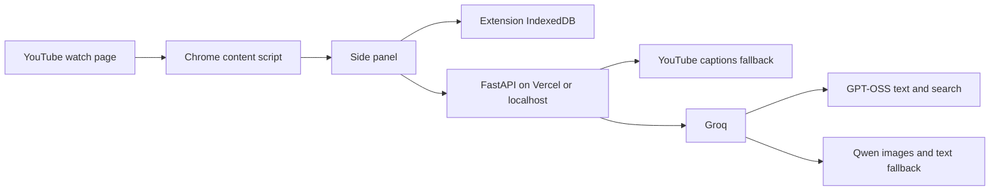

# Architecture

The content script reads the current video context and captions without inline page scripts. The side panel polls playback for the live companion and can seek to evidence timestamps. For deep analysis, it seeks to three sampled timestamps, captures the visible tab, crops each screenshot to the player, and restores playback. Frames and nearby captions are sent to Groq Qwen in one call. Visual findings refer only to sampled frames.

Groq GPT-OSS produces structured transcript analyses, plans, moment-aware answers, quizzes, flashcards, factual claim candidates, and multi-video comparisons. Qwen is the text fallback. Generated transcript timestamps and excerpts pass deterministic evidence checks before reaching the UI. Claim Check uses GPT-OSS browser search and labels a verdict only when search results include external URLs.

The backend stores no database or vector index. The personal library uses extension-local IndexedDB; cross-device synchronization would require an authenticated backend store.
